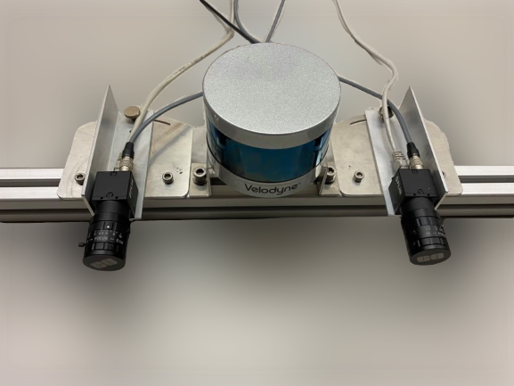

# Stereo Vision for Autonomous ferry - code
The project is a part of TTK4900 - Engineering Cybernetics, Master's Thesis at Norwegian University of Science and Technology. "Stereo Vision for Autonomous ferry" goes into detail of the calibration, the chosen stereo setup, and the implementation for testing in dynamic scenes. The ownship has adequate data to sense, process, and understand its surroundings.

## Contents
* [Getting Started](#getting-started)
* [System overviw](#system-overview)
* [Launch](#launch)
* [Connect to Network MilliAmpere](#connect-to-network-on-milliampere)
* [Application and Scrips](application-and-scrips)
* [Authors and License](#authors-and-license)


## Getting Started

Example of the stereo system tested. The baseline in use measures 1.8meters, and the cameras are angled 1 degree inwards. The stereo system was tested using [Blackfly S GigE](https://www.flir.com/products/blackfly-s-gige/?model=BFS-PGE-50S5C-C) with PoE, master software triggering, and GPIO pins for external triggering the slave. The [Velodyne LiDAR Puck-16](http://www.isaza.co/VELODYNE/63-9243%20Rev%20B%20User%20Manual%20and%20Programming%20Guide,VLP-16.pdf) serves as ground truth for the system. 

### Prerequisites
 * Set up a computer with GPU and Ubuntu 16.04. The repo is tested on Dell Precision 7530 with NVIDIA Quadro P3200.
 * Set up a stereo system, and perform stereo calibration for the cameras. 
 * Install Spinnaker and verify that you can run your cameras with SpinViw (prefer Windows operating system). Set up a stereo system with either hardware or software triggering. Modify the yaml files in spinnaker-sdk-driver replacing the cam-ids and master cam serial number to match your camera's serial number. In the same yaml file, include the calibration parameters. (If using Matlab for calibration, make sure to convert the numbers to OpenCV calibration definitions)
 * Optionally: Set up the [LiDAR driver](http://wiki.ros.org/velodyne/Tutorials/Getting%20Started%20with%20the%20Velodyne%20VLP16). The LiDAR needs to be calibrated against the stereo camera to serve as a basis for comparison.

### Installing
* [ROS Kinetic](http://wiki.ros.org/kinetic/Installation/Ubuntu)
* [CUDA 10.2](https://developer.nvidia.com/cuda-downloads) for runnning darknet ros (YOLOv3) on GPU.
* [Python](https://www.python.org/downloads/). The scripts is tested with Python 2.7.12 
  1. [Matplotlib](https://matplotlib.org/users/installing.html) and [OpenCV](https://opencv.org/)
    ```bash
    sudo apt install python-pip #Installs Python pip
    python -mpip install -U pip  
    python -mpip install -U matplotlib #Plot the results by installing Matplotlib
    python -mpip install -U opencv-python #Show animation by opencv
    ```
 * For the stereoTuner the gtk3 development files is needed for cmake: 
   `sudo apt-get install build-essential libgtk-3-dev`

## System overview
Image of the system/rosgraph to be announced :))


## Launch 
  ```bash
  cd Master
  catkin build
  source devel/setup.bash
  roslaunch launch clustering_cnn file:= "your bag file"  #launch bagfile, stereo_image_proc, yolo and clustering_cnn
  roslaunch launch clustering_ptcloud file:= "your bag file"  #launch bagfile, stereo_image_proc, clustering_ptcloud
  ```

### Run individual packages

#### Camera driver
* `roslaunch spinnaker_sdk_camera_driver acquisition.launch`
* Or Rosbag: `rosbag play "filename" --clock`
#### Stereo image proc
* `ROS_NAMESPACE=camera_array rosrun stereo_image_proc stereo_image_proc`
##### Display images
* Rectified images and disparity map`
    1. `rosrun image_view stereo_view stereo:=/camera_array image:=image_rect_color`
* Raw stereo images
    2. `rosrun image_view stereo_view stereo:=/camera_array image:=image_raw`
* Left rectified image
    3. `rosrun image_view image_view image:=/camera_arr/left/image_rect_color`

#### Clustering Point Cloud
* `roslaunch clustering pcl_obstacle_detector.launch #Need the bagfile to be run with the "--clock"`
* Tuning the parameters: `rosrun rqt_reconfigure rqt_reconfigure`
* Visualize in rviz: `rosrun rviz rviz -f velodyne`
The package filter and cluster the point cloud, publishing the point clous and clusters in NED coordinates. 
The class makes use of PassThrough filter, Statistical Outlier Removal, Voxel Grid filter, accumulates subsequent point clouds, and Euclidean clustering.

#### Darknet_ros (YOLOv3)
* `roslaunch darknet_ros yolo_v3.launch  #subscribes on camera_array/left/image_rect_color`
#### Clustering Convolutional Neural Network
* `rosrun clustering_cnn clustering_cnn`
#### Navigation data
* `rosrun navigation_data *filename*`

## Connect to Network on MilliAmpere
If the code is to be run with the master core on the ferry Milliampere a local network needs to be setup. The best solution is to set up a separate static network on the computer through usb3. 

  ```bash
  ifconfig #find your network
  sudo nano /etc/network/interfaces #add/make the network static
  nano /etc/hosts #add milliAmpere as host on machine, further do the same at milliAmpere
  sudo ifdown "your network" && sudo ifup "your network" #restarting interface
  ping milliAmpere #check if connection established 
  ```
Now that you have created a static network, one has to export the roscore. Telling your machine the roscore is running on another computer. Be sure to do this in every terminal window (can be an advantage to add in nano .bashrc) 
  ```bash
  export ROS_MASTER_URI=http://milliAmpere:11311
  echo $ROS_MASTER_URI
  rostopic echo /topic #test that connection is established
  ```
## Application and Scrips
### stereoTuner
Application for tuning the disparity map, implemented using the stereoBM object and WLS filter from openCV. The GUI is a modified version of the repository [stereo-tuner](https://github.com/guimeira/stereo-tuner). Remember to rectify the images beforehand; you're welcome. 
It is a simple little GTK application that can be used to tune parameters for the OpenCV Stereo Vision algorithms.
  ```bash
  mkdir build
  cd build
  cmake ..
  make
  ./main
  ```


### Label YOLO images
GUI for marking bounded boxes of objects in images for training Yolo v3. 

* Put your `.jpg`-images to the directory `x64/Release/data/img`. 
* Change numer of classes (objects for detection) in file `x64/Release/data/obj.data
* Put names of objects, one for each line in file `x64/Release/data/obj.names
If the images is used for training a custom dataset visit [AlexBA](https://github.com/AlexeyAB/Yolo_mark) for a more detailed explanation.  
```bash
cmake .
make
./linux_mark.sh
```

### Precision-recall curve for YOLOv3
Plot and calculate the precision-recall curve from ground truth images. It iterates through two for-loops, one with IoU-threshold and the second with the YOLO-threshold. Make sure to input detection images from the network with threshold less than the ones in the for-loop in main.py. The mAP script is a modified version of the code in the github repository [mAp](https://github.com/Cartucho/mAP). It outputs a precision-recall curve for each threshold and IoU-threshold in main.py

* Create the ground truth files using [Label YOLO images](#Label-YOLO-images)
  1. Insert images into the folder input/ground-truth/images 
  2. Insert ground-truth files into ground-truth/
  3. Add class list to the file scripts/extra/class_list.txt
  4. Run the python script: python convert_gt_yolo.py to convert the txt-files to the correct format
* Create the detection-results files by running darknet_ros (It is created code (commented out) for saving box-files and rectified images in /src/darknet_ros/darknet_ros/src/YoloObjectDetector.cpp)
  1. Copy the detection-results files into the folder input/detection-results/
* Run the script: 
     `python main.py`
  1. Note: To run the script ones, for a given IoU-threshold and YOLO-threshold,run the following command line. This wil process mAP, detection result information etc in the folder /output. 
      `python precision-recall.py "IoU-threshold" "YOLO-threshold"`

note: Be consistent with using rectifiec/not-rectified images. 
  ```bash
  python main.py
  ```
Feel free to edit the main file with your preferred values in the for-loops. 


### Plot and calculate ground truth depth and stereo depth
Match handhold-GPS csv file with the GPS from MA by satellite time. Match the stereo ros-time and plots a beautiful graph. 

TODO: add script to git and image? 


## Authors and License
Good-luck from two soon-to-be well educated grown-ups.
* **Trine Ødegård Olsen** - [trineoo](https://github.com/trineoo)
* **Lina Theimann** - [Linact](https://github.com/linact)

This project is licensed under the MIT License - see the [LICENSE.md](LICENSE.md) file for details


